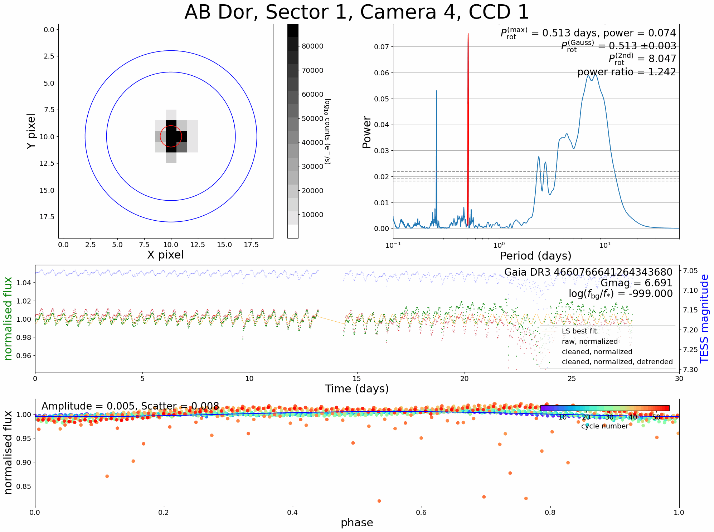

|DOI|

.. |DOI| image:: https://zenodo.org/badge/588218536.svg
        :target: https://zenodo.org/badge/latestdoi/588218536
        
|Documentation Status|

.. |Documentation Status| image:: https://readthedocs.org/projects/tessilator/badge/?version=latest
                         :target: https://tessilator.readthedocs.io/en/latest/?badge=latest

  
**WELCOME TO THE TESSILATOR**
=============================

**The one-stop shop for measuring TESS rotation periods**

The tessilator is a python program designed to provide an all-in-one module to measure
lightcurves and stellar rotation periods from the Transiting Exoplanet Survey
Satellite (TESS). Whilst there are many useful (and powerful) software tools
available for working with TESS data, they are mostly provided as various steps
in the data reduction process --- to our knowledge there are no programs that
automate the full process from downloading the data (start) to obtaining
rotation period measurements (finish). The software provided here fills this
gap. Using as little information as the name of the target, the tessilator is
capable of providing a robust lightcurve analysis and produces high-quality figures
and tables ready for publication. Sit back and let the tessilator do the hard work!

The steps are:

(1) download photometric time-series data from TESS.

(2) scan the Gaia DR3 catalogue to quantify the level of background
    contamination from nearby sources.

(3) clean the lightcurves for poor quality data caused by systematic and
    instrumental effects.

(4) normalize and detrend lightcurves over the whole sector of observations.

(5) measure stellar rotation periods using the Lomb-Scargle periodogram method

(6) quantify various data quality metrics from photometric time-series data
    which can be used by the user to assess data reliability

Ways to use the tessilator
--------------------------
**Using TESScut to obtain "cutout" images**

In this module, the data is downloaded from [TESSCut (Brasseur et al. 2019)](https://mast.stsci.edu/tesscut/) -- a service which allows the user to acquire a stack of "postage-stamp" image frames ordered in time sequence and centered on the supplied sky coordinate. It uses modules from the [TesscutClass](https://astroquery.readthedocs.io/en/latest/api/astroquery.mast.TesscutClass.html) to download the data, then applies steps 2-6 (above). This software is recommended for users who require a relatively fast extraction for a manageable number of targets. With the correct pre-requisite Python modules and an uninterrupted internet connection, a target with 5 sectors of TESS data takes approximately 1-2 minutes to complete (and approximately 3-4 minutes should the user want to analyse the lightcurves of a few neighbouring contaminants). The user can process a list of targets automatically by calling the ``all_sources_cutout.py`` function

**Analysing full-frame calibrated images**

If the user is interested in conducting a much larger survey, it is faster to run
the tessilator using the calibrated full-frame images. These can be downloaded in
bulk at the [MAST archive.](https://archive.stsci.edu/tess/bulk_downloads/bulk_downloads_ffi-tp-lc-dv.html)
This method works much faster than TESS Cutouts because multiple lightcurves can be
extracted simultaneously due to the vectorisation made possible with numpy/C-style
methods. The authors have tested this method for a catalogue of ~1 million targets,
which took less than a week to complete. The user can process a list of targets automatically by calling the ``all_sources_sector.py`` function.

Notes on using the tessilator
-----------------------------
Should there be any problems in using this software please contact Alex Binks
(lead author) at abinks@mit.edu

If this package is useful for research leading to publication we would
appreciate the following acknowledgement:

"The data from the Transiting Exoplanet Survey Satellite (TESS) was acquired
using the tessilator software package (Binks et al. 2023)."

Licence: MIT

Alexander Binks and Moritz Guenther, 2023
